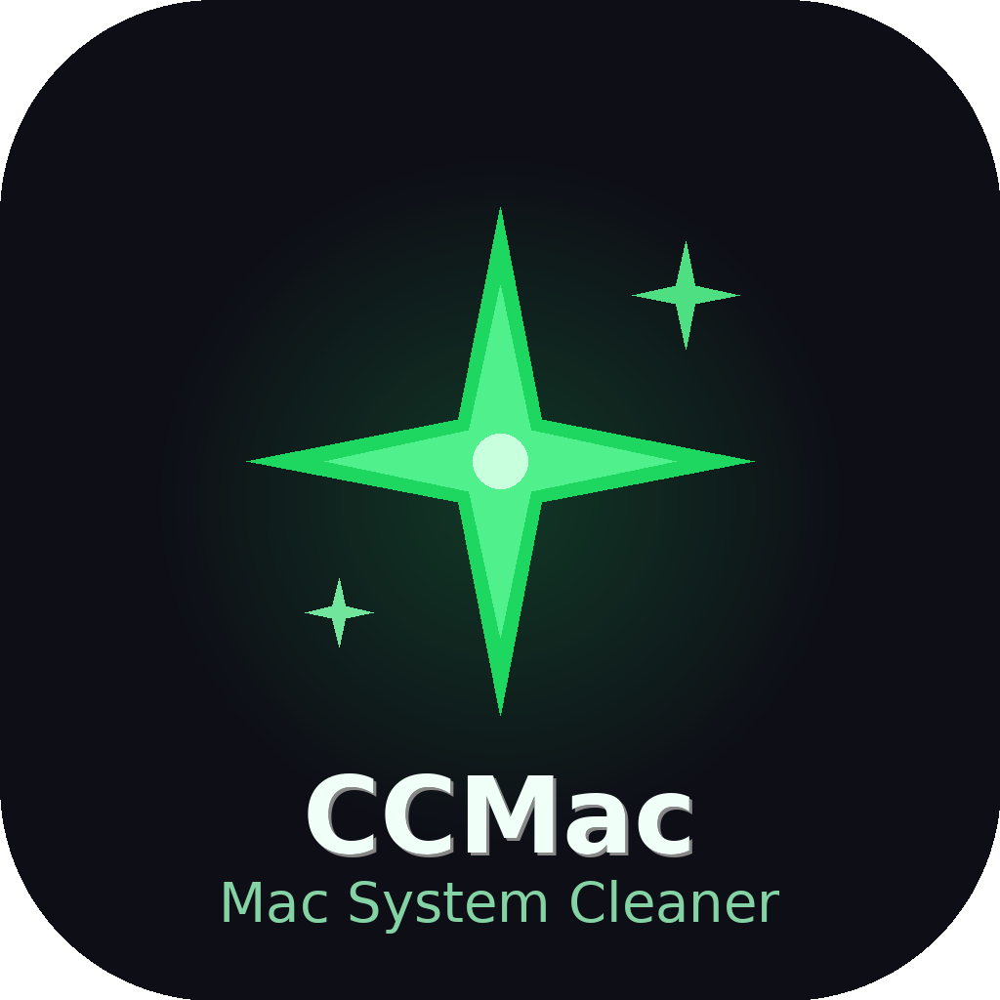

<p align="center">
  
</p>

<h1 align="center">CCMac — macOS System Cleaner</h1>

<p align="center">
  A native, open-source macOS cleaner built entirely with Swift & SwiftUI.
  <br/>
  Real system APIs. Zero telemetry. Polished dark-mode UI.
</p>

<p align="center">
  
  
  
  
  
</p>

---

## What is CCMac?

CCMac is a full-featured macOS system cleaner that uses **real macOS system APIs** — no fake scans, no performance theater. It scans junk files, monitors live system metrics, detects duplicate files, visualizes disk usage as an interactive treemap, and provides AI-powered health recommendations — all in one native dark-mode app.

---

## For End Users

### Install with DMG

1. Download the latest **`CCMac-1.0.0.dmg`** from [Releases](https://github.com/kechankrisna/CCMac/releases)
2. Open the DMG → drag **CCMac.app** into **Applications**
3. **First launch:** right-click the app → **Open** (required once for ad-hoc signed builds)
4. Grant **Full Disk Access** when prompted for full scanning capability:
   > System Settings → Privacy & Security → Full Disk Access → add CCMac

### System Requirements

| | Minimum |
|---|---|
| macOS | 13 Ventura or later |
| Architecture | Apple Silicon (M1+) or Intel |
| Disk space | ~10 MB |

### Features

| Module | What it does |
|--------|-------------|
| 🔵 **Smart Care** | One-click hub — runs all modules, shows a 0–100 health score ring |
| 🧹 **Cleanup** | Scans system caches, logs, mail attachments, Xcode DerivedData, language files, Trash |
| 🛡 **Protection** | Quick / Normal / Deep threat scanner, app permissions manager, browser privacy cleaner |
| ⚡ **Performance** | Live CPU, RAM, disk, battery, network monitors; process manager; maintenance tasks |
| 📦 **Applications** | All installed apps with sizes, leftover file finder, one-click uninstall |
| 🔍 **My Clutter** | MD5-based duplicate finder; large & old file detector |
| 🗂 **Space Lens** | Interactive treemap visualising disk usage — drill into any folder |
| ☁️ **Cloud Cleanup** | iCloud · Google Drive · OneDrive · Dropbox — scan & remove cloud junk |
| 🤖 **AI Assistant** | Real-time health report with prioritised, actionable recommendations |

### Menu Bar

Click the ✦ icon in the menu bar for a live dashboard: CPU · RAM · Disk · Battery · Network. Use **Smart Care** and **Scan Now** buttons to jump straight into a scan without opening the main window.

---

## For Developers

### Prerequisites

| Tool | Version |
|------|---------|
| macOS | 13 Ventura+ |
| Xcode | 15+ |
| Swift | 5.9+ |

### Quick Start

```bash
git clone https://github.com/kechankrisna/CCMac.git
cd CCMac

# Run (debug)
swift build && .build/debug/CCMac

# Or open in Xcode
open Package.swift
```

In Xcode, set **Destination → My Mac** and press **⌘R**.

### Build a distributable DMG

```bash
bash build_dmg.sh
# → produces CCMac-1.0.0.dmg
```

The script: compiles a release build → assembles a `.app` bundle → generates `AppIcon.icns` from the PNG → ad-hoc signs → wraps into a compressed DMG.

### Xcode Build Settings (one-time)

| Setting | Value |
|---------|-------|
| `PRODUCT_BUNDLE_IDENTIFIER` | `com.ccmac.app` |
| `INFOPLIST_FILE` | `Sources/CCMac/Resources/Info.plist` |

### Project Structure

```
CCMac/
├── Package.swift                        # Swift Package Manager manifest
├── build_dmg.sh                         # Release build → .app → DMG
├── README.md                            # This file
├── TECHNICAL.md                         # Full architecture & developer reference
├── LICENSE
└── Sources/CCMac/
    ├── App/
    │   ├── CCMacApp.swift               # @main entry, NSStatusItem, AppDelegate, Settings
    │   └── ContentView.swift            # Root layout: sidebar + module switcher
    ├── DesignSystem/
    │   ├── AppColors.swift              # Color palette, LinearGradient presets
    │   └── AppTypography.swift          # Font scale, spacing tokens, radius tokens
    ├── Models/
    │   └── AppModels.swift              # All data models + Notification.Name constants
    ├── Services/
    │   ├── SystemMonitorService.swift   # CPU / RAM / Disk / Battery / Network / Processes
    │   ├── CleanupService.swift         # Filesystem scanner + safe file deletion
    │   ├── AppManagerService.swift      # App listing, leftover finder, uninstaller
    │   ├── DuplicateFinderService.swift # MD5 duplicate + large file detection
    │   ├── StorageService.swift         # Recursive disk tree builder for Space Lens
    │   └── MaintenanceService.swift     # DNS flush, maintenance scripts, Spotlight re-index
    ├── Components/
    │   ├── SidebarView.swift            # 220 px animated sidebar
    │   └── SharedComponents.swift       # Reusable UI primitives
    ├── Modules/
    │   ├── SmartCare/SmartCareView.swift
    │   ├── Cleanup/CleanupView.swift
    │   ├── Protection/ProtectionView.swift
    │   ├── Performance/PerformanceView.swift
    │   ├── Applications/ApplicationsView.swift
    │   ├── MyClutter/MyClutterView.swift
    │   ├── SpaceLens/SpaceLensView.swift
    │   ├── CloudCleanup/CloudCleanupView.swift
    │   └── Assistant/AssistantView.swift
    ├── MenuBar/
    │   └── MenuBarView.swift            # 340×420 px live-metrics popover
    └── Resources/
        ├── Info.plist                   # Bundle ID, LSMinimumSystemVersion, privacy keys
        └── AppIcon.png                  # 1024×1024 source icon (replace to customise)
```

### Architecture at a Glance

```
┌─────────────────────────────────────────────────┐
│  CCMacApp (@main)  ·  AppDelegate (NSStatusItem) │
└──────────────┬──────────────────┬────────────────┘
               │                  │
        ContentView          MenuBarPopoverView
     (sidebar + modules)    (live metrics popover)
               │                  │
    ┌──────────▼──────┐    NotificationCenter
    │  9 Module Views │◄───────────────────────────┐
    └──────────┬──────┘                            │
               │  @StateObject / @ObservedObject    │
    ┌──────────▼──────────────────────────────┐    │
    │           Service Layer                  │    │
    │  SystemMonitor · Cleanup · AppManager   │    │
    │  DuplicateFinder · Storage · Maintenance│    │
    └──────────┬──────────────────────────────┘    │
               │  macOS system APIs                 │
    ┌──────────▼──────────────────────────────┐    │
    │  host_processor_info · getifaddrs       │    │
    │  IOKit · proc_listpids · FileManager    │    │
    │  CryptoKit · Process (shell commands)   │    │
    └─────────────────────────────────────────┘    │
                                                    │
    MenuBarView buttons ───────────────────────────┘
    (Smart Care / Scan Now / Open CCMac)
```

For full technical details — services, state machines, known fixes, design tokens, and how to add a new module — see **[TECHNICAL.md](TECHNICAL.md)**.

---

## Design System

Dark-mode first, light-mode ready. Based on a custom Figma design guide.

| Token | Value | Usage |
|-------|-------|-------|
| Background | `#0F1B26` | Main window background |
| Surface | `#1C2E3E` | Cards and panels |
| Brand Green | `#2E9C6A` | Primary CTA, health ring |
| Brand Blue | `#1A6B9A` | Links, info accents |
| Danger Red | `#E05252` | Threats, destructive actions |
| Text Primary | `#FFFFFF` | Headings and labels |
| Text Secondary | `#8BA8BE` | Subtitles and descriptions |

Typography: SF Pro Display / SF Pro Text · 8 px grid · 24 px gutter

---

## Privacy

CCMac accesses your file system only to scan and report — it never uploads data, contacts remote servers, or tracks usage. The three `NSUsageDescription` keys in `Info.plist` cover Desktop, Documents, and Downloads access for file scanning only.

---

## Contributing

Pull requests are welcome! Please open an issue first to discuss what you'd like to change.

```bash
git checkout -b feature/your-feature
git commit -m "feat: describe your change"
git push origin feature/your-feature
# then open a Pull Request
```

---

## Limitations & Known Gaps

- **Malware detection** scans the filesystem but ships without a threat database. Integrate [ClamAV](https://www.clamav.net/) for real-world detection.
- **Cloud cleanup** UI is complete; OAuth tokens for Google Drive / OneDrive / Dropbox require registering your own API credentials.
- **Full Disk Access** must be granted manually in System Settings for scanning protected directories.

---

## Author

**KE CHANKRISNA** · ke.chankrisna168@gmail.com

## License

MIT License — see [LICENSE](LICENSE) for details.
